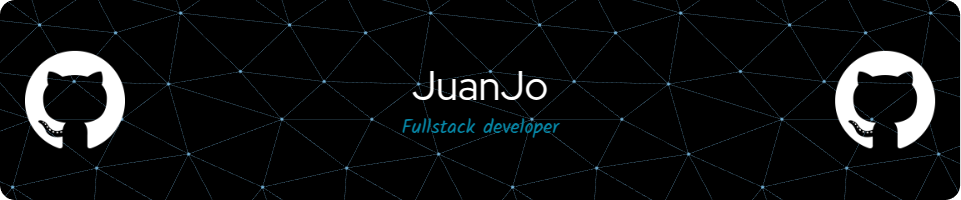

<!-- Banner superior -->

  

<!-- Banner adicional -->

<!-- Título con degradado y estilo personalizado -->
<h1 align="center" style="font-family: 'Comic Sans MS', cursive, sans-serif; background: linear-gradient(45deg, #6a11cb, #2575fc); -webkit-background-clip: text; color: transparent;">
  Hi, I'm JuanJo5433 👋
</h1>

<!-- Introducción personalizada -->

  Welcome to my little corner of GitHub! 
  I'm a passionate Full-Stack Developer who loves transforming ideas into reality using <strong>React, React Native, Node.js & MongoDB</strong>. 
  Currently, I’m growing and creating magic at <strong>Globant</strong>. 
  When I'm not coding, you'll probably find me exploring new tech, gaming, or enjoying a great cup of coffee. ☕

<!-- Cita personal -->

  <em>"Coding is not just a skill, it's an art. I love turning ideas into reality."</em>

<!-- Información de contacto con logos -->

  
  

## 🚀 Technologies & Tools

  

## 💬 About Me

  I'm a creative problem solver with a knack for designing seamless digital experiences.  
  My journey in development is fueled by curiosity and a constant desire to learn something new every day.

## 🔥 GitHub Stats

  

  

  

## 🐍 GitHub Contribution Snake

  

## 📊 Profile Views

  

<!-- Banner inferior -->

  

